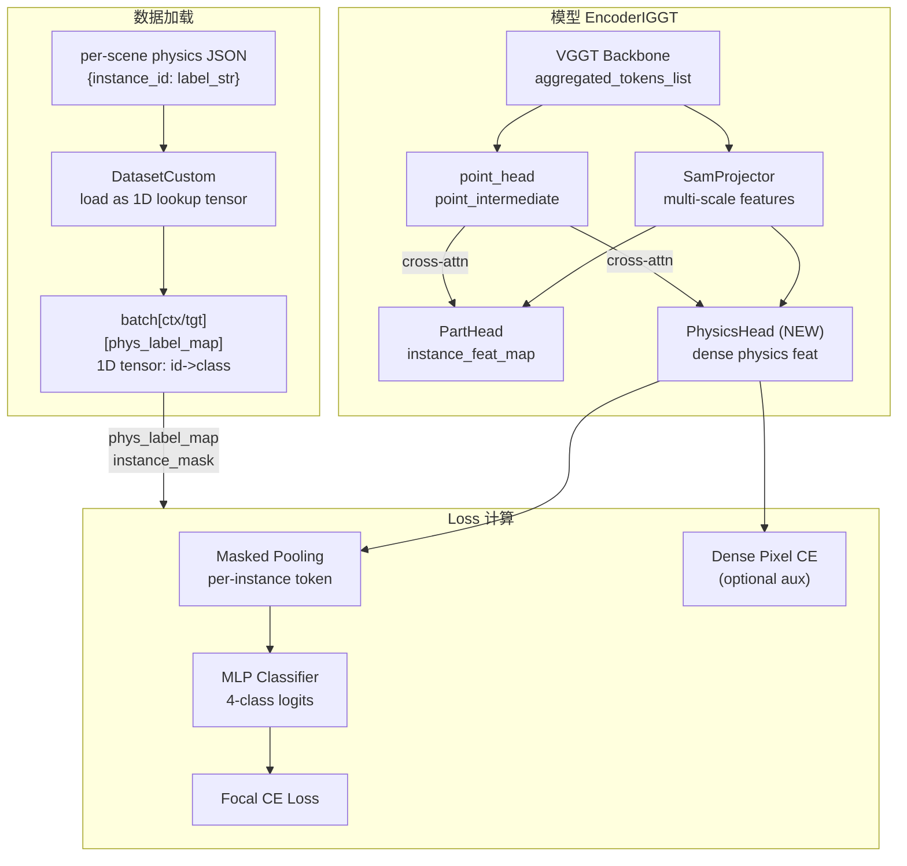

# Physics Head MVP 实施计划

## 整体数据流




## 1. 数据层：加载 physics labels

**文件**: [src/dataset/dataset_custom.py](src/dataset/dataset_custom.py)

physics label 是 **per-instance** 的属性，不是 per-pixel 的空间 tensor，所以只需要一个 ID→class 的 lookup table，**不需要改 crop_shim**。

### 数据格式约定

每个 scene 在 manifest 中可通过 `physics_labels_path` 字段指定一个 JSON 文件路径（可选）：

```json
{
  "1": "static",
  "2": "rigid",
  "3": "soft",
  "15": "unknown"
}
```

Label 映射（硬编码常量）：

```python
PHYS_LABEL_MAP = {"static": 1, "rigid": 2, "soft": 3, "unknown": 4}
PHYS_IGNORE_ID = 0  # 无标注的 instance
```

### 修改内容

- 新增 `_load_physics_labels(path)` 方法：读 JSON，返回 `dict[int, int]`（instance_id → phys_class_int）
- 在 `getitem` 中（`load_stack` 之外、scene 级别）：如果 scene 有 `physics_labels_path`，加载 label dict，构造 **1D lookup tensor** `[max_id + 1]`（`phys_label_map[id] = class_int`，无标注 ID 为 0）
- 写入 `example["context"]["phys_label_map"]` 和 `example["target"]["phys_label_map"]`（两者共享同一个 tensor，因为物理属性是 scene 级别的，和具体 view 无关）
- **不需要修改 crop_shim** — 这是一个非空间的 1D tensor，与图像分辨率无关

## 2. 模型层：PhysicsHead

### 2a. PhysicsHead 模块

**新文件**: `src/model/encoder/iggt_heads/physics_head.py`

结构与 [PartHead](src/model/encoder/iggt_heads/part_head.py) 对称：

- **DPT fusion**: 4 级 `layer_rn` (Conv2d) + 4 级 `_FeatureFusionBlock`，`features=256`
- **Cross-attention with point_intermediate**: 2-3 个尺度的 `MemEffCrossAttention`（复用 `attention_blocks.py`），接口与 PartHead 相同
- **Window self-attention**: `SwinSA`
- **可选 Window cross-attention**: `SwinCA`（config 开关）
- **Output conv**: 输出 dense physics feature `[B*V, phys_feat_dim, H, W]`
- **Pooling + Classifier** (作为子模块):
  - `masked_pool(feat_map, instance_mask)` → per-instance mean → `[K, phys_feat_dim]`
  - 可选 concat instance embedding mean（config 开关）
  - MLP: `phys_feat_dim (+inst_feat_dim) → hidden → num_classes`
  - 输出 logits `[K, num_classes]`

关键设计：Head 主干容量不削减（为未来扩展留空间），只有最终 output head 是轻量的 MLP classifier。

### 2b. 修改 EncoderIGGT

**文件**: [src/model/encoder/iggt.py](src/model/encoder/iggt.py)

- `EncoderIGGTCfg` 新增字段:
  - `phys_head_enabled: bool = False`
  - `phys_feat_dim: int = 32`
  - `phys_num_classes: int = 4`
  - `phys_use_point_feat: bool = True` (是否用 point_intermediate cross-attention)
  - `phys_use_inst_feat: bool = False` (是否 concat instance embedding)
- `__init`__ 中：如果 `phys_head_enabled`，实例化 `PhysicsHead`
- `forward` 中：如果有 PhysicsHead，将 SamProjector 输出 + point_intermediate 传入 PhysicsHead，得到 dense physics feat map
- **不在 encoder forward 里做 pooling/分类**（留给 loss 做，因为需要 GT mask）

### 2c. 修改 EncoderOutput

**文件**: [src/model/encoder/encoder.py](src/model/encoder/encoder.py)

- 新增字段: `physics_feat_map: Float[Tensor, "batch view c height width"] | None = None`

### 2d. 注册导出

**文件**: [src/model/encoder/iggt_heads/**init**.py](src/model/encoder/iggt_heads/__init__.py) — 导出 `PhysicsHead`

## 3. Loss 层：LossPhys

**新文件**: `src/loss/loss_phys.py`

### Config

```python
@dataclass
class LossPhysCfg:
    weight: float = 1.0
    num_classes: int = 4
    ignore_id: int = 0  # phys_label_map 中为 0 的 instance 不参与 loss
    # Focal loss params
    focal_gamma: float = 2.0
    focal_alpha: list[float] | None = None  # per-class alpha, None=均匀
    # Dense auxiliary loss (config 开关)
    dense_aux_weight: float = 0.0  # 0 = 关闭
    # 分类器相关
    phys_feat_dim: int = 32
    classifier_hidden: int = 64
    use_inst_feat: bool = False
    inst_feat_dim: int = 8
    # Cross-view pooling
    cross_view_pool: bool = True
```

### 核心逻辑

`forward(prediction, batch, gaussians, depth_dict, global_step)`:

1. 从 `depth_dict` 取 `physics_feat_map [B,V,C,H,W]`、`instance_mask [B,V,H,W]`、`phys_label_map [B, max_id+1]`（1D lookup）、可选 `instance_feat_map [B,V,D,H,W]`
2. **Per-instance masked pooling**:
  - 遍历每个 batch，从 `instance_mask` 找所有出现的 instance ID
  - 用 `phys_label_map[id]` 查出每个 instance 的 GT label，跳过 label=0（ignore）的 instance
  - 对每个有标注的 instance，在所有 view 上做 masked average pooling → `[C]`
  - 可选 concat instance feat mean → `[C+D]`
3. **MLP 分类**: logits `[K, num_classes]`
4. **Focal CE Loss**: 对 per-instance logits 计算
5. **可选 Dense auxiliary CE**: 将 per-instance GT 通过 instance_mask 广播回 per-pixel，对 dense physics feat map 加一层 1x1 conv → `[B*V, num_classes, H, W]`，per-pixel focal CE

注意：Classifier 和可选的 dense projection 作为 Loss 模块的子 `nn.Module` 参数（这样它们的参数自动被 optimizer 管理）。这符合项目现有模式（loss 是 `nn.Module`）。

### 注册

**文件**: [src/loss/**init**.py](src/loss/__init__.py)

- import `LossPhys, LossPhysCfgWrapper`
- 添加到 `LOSSES` 字典
- 添加到 `LossCfgWrapper` union type

**新文件**: `config/loss/phys.yaml`

```yaml
phys:
  weight: 1.0
  num_classes: 4
  ignore_id: 0
  focal_gamma: 2.0
  dense_aux_weight: 0.0
```

## 4. Wrapper 层：传递 physics 数据

**文件**: [src/model/iggt_wrapper.py](src/model/iggt_wrapper.py)

在 `training_step` 中，`depth_dict_for_loss` 新增注入:

- `depth_dict_for_loss["physics_feat_map"] = encoder_output.physics_feat_map`
- `depth_dict_for_loss["phys_label_map"]`: 从 batch context 取（scene 级别，context/target 共享同一份 lookup tensor）

## 5. 配置层

### Encoder config

**文件**: [config/model/encoder/iggt.yaml](config/model/encoder/iggt.yaml)

新增 physics head 默认关闭的字段。

### 新实验配置

**新文件**: `config/experiment/phys_iggt_custom.yaml`

```yaml
# @package _global_
defaults:
  - /dataset@_group_.custom: custom
  - override /model/encoder: iggt
  - override /loss: [disc, phys]

model:
  encoder:
    pretrained_weights: "..."
    phys_head_enabled: true
    phys_feat_dim: 32
    phys_num_classes: 4
    phys_use_point_feat: true

optimizer:
  freeze_keywords: [aggregator, camera_head]
  param_groups:
    - keywords: [part_adaptor, part_head]
      lr_multiplier: 0.0  # 冻结 PartHead (可消融)
    - keywords: [physics_head]
      lr_multiplier: 1.0
    - keywords: [point_head, depth_head]
      lr_multiplier: 0.1

loss:
  disc:
    weight: 1.0
    delta_v: 0.5
    delta_d: 1.0
  phys:
    weight: 1.0
    focal_gamma: 2.0
    dense_aux_weight: 0.0  # 默认关闭，消融时打开
```

## 6. 消融开关汇总

所有设计选择均为 config 可控，便于后续消融：

- **A1** `phys_use_point_feat`: 是否用 point_intermediate cross-attention
- **A2** `phys_use_inst_feat`: 是否 concat PartHead instance embedding
- **A3** 共享 vs 独立 SamProjector（MVP 先共享，后续可加开关）
- **L1** `focal_gamma` / `focal_alpha`: Focal Loss 参数（gamma=0 退化为 CE）
- **L2** `dense_aux_weight`: Dense pixel-level auxiliary loss 开关
- **L3** `cross_view_pool`: 跨视角池化开关
- **T1** `part_head lr_multiplier`: 冻结 vs 微调 PartHead

