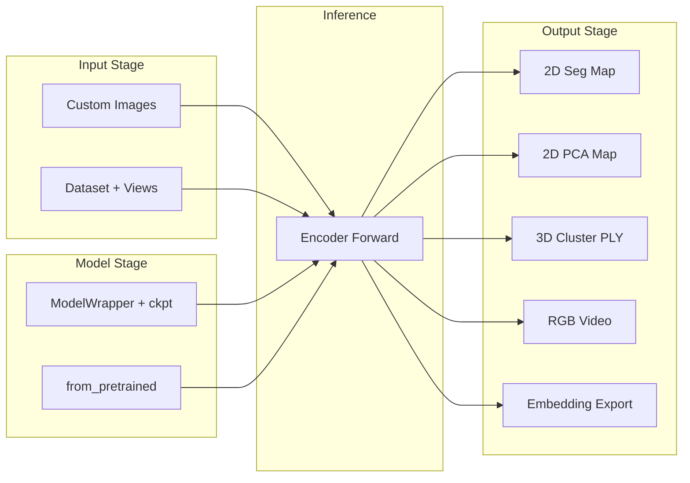

# 统一推理脚本重构方案

## 现状分析

三个脚本功能高度重叠：

- `[scripts/debug_instseg_ckpt.py](scripts/debug_instseg_ckpt.py)`：ModelWrapper 加载 → 数据集采样 → encoder → 2D feat_map k-means → 保存分割图
- `[scripts/debug_instseg_export_cluster_ply.py](scripts/debug_instseg_export_cluster_ply.py)`：ModelWrapper 加载 → 数据集采样 → encoder → 3D gaussian_feat 聚类 → 导出 PLY
- `[instseg_inference.py](instseg_inference.py)`：from_pretrained 加载 → 自定义图片 → encoder → 导出 PLY + embedding

共同的重复部分：配置加载、权重加载、view sampler 构建、数据集构建、encoder forward。

## 设计思路

新建一个 `scripts/anysplat_infer.py`，按 **输入 / 模型 / 推理 / 输出** 四个阶段解耦，每个阶段独立为函数或类。输出支持组合选择，通过 `--outputs` 参数指定一个或多个输出模式。




## 核心模块设计

### 1. Input Stage — `load_input()`

两种模式，通过 subcommand 或 `--input_mode` 切分：

- `**images` 模式**：`--image_dir / --image_paths`，用 `process_image()` 处理自定义图片，生成 `[1,V,3,H,W]` tensor
- `**dataset` 模式**：`--run_dir`（含 `.hydra/config.yaml`），`--scene_id`（可选，不指定则随机），`--context_views / --target_views`（可选，不指定则随机采样），`--num_context / --num_target`

返回统一的 `InferenceInput` dataclass：

```python
@dataclass
class InferenceInput:
    images: Tensor          # [1, V, 3, H, W] in [0,1]
    meta: dict              # scene_id, view_indices, source 等信息
    # 以下可选（dataset 模式才有）
    gt_instance_mask: Tensor | None
    depth: Tensor | None
    intrinsics: Tensor | None
    extrinsics: Tensor | None
```

View sampler 逻辑复用现有 `_FixedSampler` / `_RandomSampler`，但提取为共享工具函数（放在脚本内即可，不需要改 src）。

### 2. Model Stage — `load_model()`

- 如果给了 `--run_dir + --ckpt`：走 ModelWrapper 路线（支持 instance head）
- 如果给了 `--hf_model`（或不给 run_dir）：走 `AnySplat.from_pretrained` 路线
- 可选 `--instance_feat_dim` 控制是否启用 instance head

返回 `model`（eval 模式，在指定 device 上）。

### 3. Inference Stage — `run_inference()`

```python
def run_inference(model, inp: InferenceInput, device) -> EncoderOutput:
    with torch.no_grad():
        return model.encoder(inp.images.to(device), global_step=0, visualization_dump=None)
```

如果是 `from_pretrained` 模式且需要位姿/视频，也可以走 `model.inference()` 路径。

### 4. Output Stage — 可组合的输出函数

通过 `--outputs seg2d,pca2d,seg3d_ply,video,embedding` 选择，每个输出是一个独立函数：

- `**seg2d**`：复用 `[src/visualization/instance_viz.py](src/visualization/instance_viz.py)` 的 `cluster_instance_embeddings` + `colorize_labels`，保存多视角分割图
- `**pca2d**`：复用 `pca_visualize_embeddings`，保存 PCA 可视化
- `**seg3d_ply**`：对 `gaussian_instance_feat` 做聚类（kmeans/dbscan/hdbscan），复用现有聚类函数，调用 `export_ply` 导出
- `**video**`：调用 `save_interpolated_video` 生成 RGB/depth 视频
- `**embedding**`：调用 `export_gaussian_instance_embedding` 保存原始嵌入

每个输出函数签名统一：

```python
def output_seg2d(enc_out: EncoderOutput, inp: InferenceInput, cfg: OutputConfig, out_dir: Path) -> None
def output_pca2d(enc_out: EncoderOutput, inp: InferenceInput, cfg: OutputConfig, out_dir: Path) -> None
def output_seg3d_ply(enc_out: EncoderOutput, inp: InferenceInput, cfg: OutputConfig, out_dir: Path) -> None
```

### 5. CLI 设计

```
python scripts/anysplat_infer.py \
    # 输入（二选一）
    --image_dir path/to/images \
    # 或
    --run_dir output/xxx --ckpt path/to.ckpt --scene_id my_scene --context_views 0,1 --target_views 2,3 \
    # 模型（可选，有 run_dir+ckpt 时自动用 ModelWrapper）
    --hf_model lhjiang/anysplat \
    --instance_feat_dim 16 \
    # 输出（可组合）
    --outputs seg2d,pca2d,seg3d_ply \
    # 输出参数
    --out_dir outputs/infer_result \
    --cluster_algo kmeans --k 20 \
    --device cuda
```

### 6. 文件变更

- **新建** `scripts/anysplat_infer.py`：统一推理脚本（约 400-500 行）
- **不修改** 现有 `src/` 代码（所有复用通过 import 实现）
- **不删除** 旧脚本（保留向后兼容，但可以在注释中标注 deprecated）

### 7. 扩展性

新增输出类型只需：

1. 写一个 `output_xxx()` 函数
2. 在 `OUTPUT_REGISTRY` dict 中注册
3. 在 argparse 中添加相关参数（如有需要）

```python
OUTPUT_REGISTRY: dict[str, Callable] = {
    "seg2d": output_seg2d,
    "pca2d": output_pca2d,
    "seg3d_ply": output_seg3d_ply,
    "video": output_video,
    "embedding": output_embedding,
}
```

