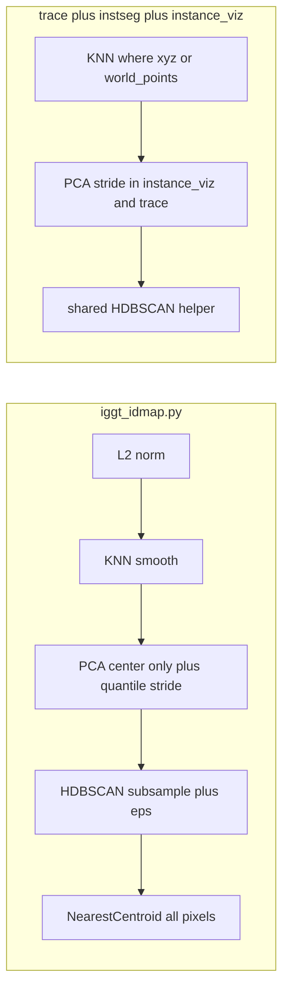

# 同步 iggt_idmap 后处理到 trace / instseg

## 参考实现（canonical）

[iggt_idmap.py](iggt_idmap.py) 中与「后处理」直接相关的行为：

| 步骤                                   | 行为                                                                                                                                                                               |
| ------------------------------------ | -------------------------------------------------------------------------------------------------------------------------------------------------------------------------------- |
| PCA (`pca_visualize`)                | 全体像素 **L2 归一化** → 用 **全局均值去中心（不除以 std）** → `torch.pca_lowrank` → 分通道 **分位数拉伸**；超大张量用 **stride 子采样** 算 quantile（见 `max_quantile_elems`）                                           |
| HDBSCAN (`cluster_features_hdbscan`) | 特征已 L2 归一化；**随机子采样**（`max_cluster_points`，`rng=0`）→ `HDBSCAN(cluster_selection_epsilon=eps, ...)` → 若簇数 ≥2 用 **NearestCentroid** 对 **全部点** `predict` → **全局 contiguous relabel** |

前置：**L2** → **3D KNN 平滑**（`knn_smooth_features`）→ PCA；聚类前可选 **spatial concat**（`spatial_weight`，仍可作为后续可选项）。

## 本版范围（你已确认要做）

- **3D KNN 平滑**：纳入实现范围（不再列为「可选」）。
  - **trace**：后处理阶段用 PLY 中的 `xyz` 与当前 Gaussian 特征做与 [iggt_idmap.knn_smooth_features](iggt_idmap.py) / [instance_viz._knn_smooth_features_impl](src/visualization/instance_viz.py) 相同的 cKDTree 平均邻域特征；CLI 如 `--postprocess_knn_k`（默认 `0` 表示关闭，与 iggt 默认 `20` 在文档中说明对齐方式）。
  - **instseg**：若 encoder 输出含 `world_points`，在 **seg2d / pca2d**（以及与之共用同一份 `instance_feat_map` 的逻辑）上，对特征先走现有 [knn_smooth_instance_features](src/visualization/instance_viz.py)，与 [base_wrapper](src/model/base_wrapper.py) 注释中的 iggt 对齐说明一致；若当前 infer 脚本未调用，则在取 `instance_feat_map` 后、聚类/PCA 前补上。
- `**pca_visualize_embeddings` 超大分位数**：纳入实现范围。在 [src/visualization/instance_viz.py](src/visualization/instance_viz.py) 的 `pca_visualize_embeddings` 里，对 `proj` 各通道的 quantile 计算采用与 iggt `pca_visualize` 相同的 **stride 子采样**策略（或共享一个小工具函数），避免 `V*H*W` 极大时 `torch.quantile` 过慢或占用过高。

## 现状差距

### 1. [scripts/trace_instance_to_gaussians.py](scripts/trace_instance_to_gaussians.py)

- `pca_colorize_gaussians`：对 valid 子集做 **均值+std** 再 PCA，与 iggt / instance_viz 的「**仅去中心**」不一致；且缺少大 `G` 的 quantile stride。
- 后处理：**无** 基于 PLY xyz 的 KNN 平滑。
- `_cluster_hdbscan`：缺少 `cluster_selection_epsilon`；全量/子采样路径与 iggt 的 NearestCentroid 全点赋值需对齐（见原策略）。

### 2. [scripts/instseg_infer.py](scripts/instseg_infer.py)

- `output_pca2d` 已用 `pca_visualize_embeddings`；**算法上**与 iggt 一致的部分在 instance_viz 内补齐 **quantile stride** 后即与 iggt 完全同策略。
- `_cluster_2d` 的 hdbscan：与 iggt 的 NearestCentroid + `eps` 不一致。
- `_cluster_3d_hdbscan`：缺子采样、`eps`、与 iggt 一致的赋值流程。
- **KNN**：若脚本层未在 seg2d/pca2d 前平滑，需补上（与 iggt 流水线一致）。

## 推荐实现策略（减少三份重复）

1. **共用 HDBSCAN**：新模块（如 `src/instseg/hdbscan_assign.py`）提供 `(N,D)` numpy 接口，逻辑对齐 `cluster_features_hdbscan`；`iggt_idmap.py` 改为调用。
2. **trace**：PCA + 可选 KNN + HDBSCAN 参数如前计划；CLI 增加 `hdbscan_cluster_selection_epsilon`、`postprocess_knn_k`。
3. **instseg**：共用 HDBSCAN + `eps`；seg2d/pca2d 前条件调用 `knn_smooth_instance_features`。
4. **instance_viz**：`pca_visualize_embeddings` 增加 quantile stride（可与 iggt 抽共用函数，避免两处 magic number 不一致）。

## 可选（仍非本版必做）

- **spatial_weight**（聚类特征拼接归一化 xyz）：有 3D 即可做，若你希望与 iggt CLI 完全一致可再开一轮。

---

## 「验证」是什么意思、怎么做、能做到哪一步

原句 **「抽样跑 iggt_idmap vs instseg seg2d / trace postprocess 对比行为与性能」** 指：

| 维度     | 含义                                                          | 怎么做（可执行、不要求你手工算指标）                                                                                                                                                                    |
| ------ | ----------------------------------------------------------- | ------------------------------------------------------------------------------------------------------------------------------------------------------------------------------------- |
| **行为** | 算法改完后，输出是否「看起来像同一套管线」（PCA 不过曝/不糊成一团，HDBSCAN 簇数合理、少异常全黑/全单色） | 用**同一小场景**（少量视角、分辨率不要过大）：跑一遍 `iggt_idmap.py` 看 `pca_vis/` 与 `id_maps/`；再跑 `instseg_infer.py` 的 `seg2d`/`pca2d` 与 `trace_instance_to_gaussians.py` 的 `--postprocess`，**肉眼对比** PNG/PLY。 |
| **性能** | 改 stride / 子采样 / KNN 后，是否明显变慢或内存爆掉                          | 同一命令前后各跑一次，看 **终端打印耗时** 或 `time`；大场景只抽样跑 1～2 次即可。                                                                                                                                     |

**做不到 / 不应承诺的点**：

- **不要求** iggt_idmap 与 instseg/trace 的 label **逐像素或逐高斯完全一致**（输入分辨率、valid mask、是否先 KNN、随机子采样是否同一子集都会导致差异）。
- **自动化像素级 diff** 不是验收标准；若需要可再加「簇数量、非零标签比例」等 **日志统计** 作弱回归，属于加分项而非必须。

**实现侧（Agent）能做的事**：改完后在环境里 **实际跑通** 相关命令（若数据路径在仓库内或你提供）；若缺权重/数据，则改为 **pytest 级单元测试**（小随机张量上 HDBSCAN 辅助函数、PCA quantile 不崩溃）。**不能**替你在业务大数据上做完所有主观视觉验收——那一步由你在本地看图确认即可。

---

